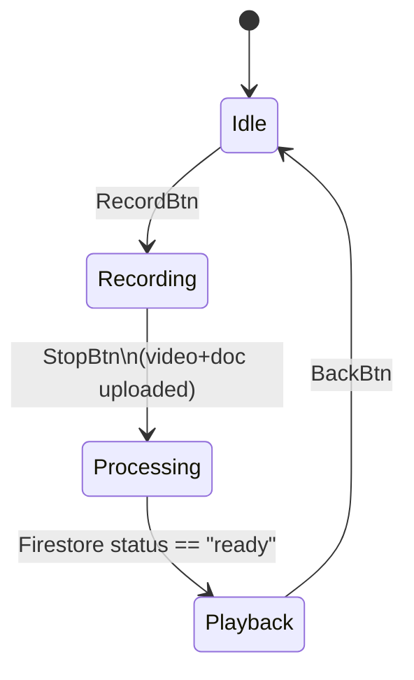

# TENDOR Climbing - Architecture Documentation

## 🏗️ System Architecture

### Tech Stack
| Layer | Technology | Purpose |
|-------|------------|---------|
| Mobile Client | Unity 2023 LTS + AR Foundation | Single AR codebase for iOS/Android |
| Authentication | Firebase Authentication | Apple/Google/email sign-in |
| Blob Storage | Firebase Storage | Resumable uploads + CDN |
| Metadata DB | Cloud Firestore | Realtime listeners |
| Serverless | Cloud Functions v2 (Node 20 + TS) | Event-driven processing |
| External Processing | DeepMotion REST API | MP4 → FBX + JSON conversion |
| Push Notifications | Firebase Cloud Messaging | "Climb processed" notifications |

**Target Load**: ~1,000 videos (≤200MB each) in year 1

## 📊 Data Models

### Firestore Collections

```typescript
// gyms/{gymId} [optional]
interface GymData {
  name: string;
  location: GeoPoint;
  createdAt: Timestamp;
}

// boulders/{boulderId} ← admin creates & owns
interface BoulderData {
  gymId?: string;           // FK → gyms/* (nullable)
  name: string;             // "MoonBoard A-2"
  grade: string;            // "V4+"
  targetUrl: string;        // gs://imageTargets/...
  physicalWidthM: number;   // AR sizing
  isActive: boolean;        // hide if reset
  createdAt: Timestamp;
}

// climbs/{climbId} ← user recording
interface ClimbData {
  ownerUid: string;         // auth.uid
  boulderId: string;        // FK → boulders/*
  videoUrl: string;         // gs://videos/...
  fbxUrl?: string;          // gs://outputs/... (nullable)
  jsonUrl?: string;         // gs://outputs/... (nullable)
  status: 'uploading' | 'processing' | 'ready' | 'error';
  createdAt: Timestamp;
}
```

### Storage Layout
```
imageTargets/{gymId or "global"}/{boulderId}.jpg   ← admin upload
videos/{uid}/{climbId}.mp4                         ← user upload
outputs/{uid}/{climbId}.fbx                        ← processed output
outputs/{uid}/{climbId}.json                       ← processed output
```

## 🔄 State Machine

### Single-Scene Flow


### State Responsibilities
| State | Duties |
|-------|--------|
| **Idle** | Show menu (Record/Library/Latest Play) |
| **Recording** | • Ensure runtime image-library loaded<br>• First tracked image → lock pose, start video + hip log<br>• Stop → upload MP4, create climbs/ doc (status=uploading) |
| **Processing** | Progress UI (upload %, DeepMotion polling) |
| **Playback** | Download/stream FBX + JSON, spawn avatar, align to locked pose<br>Controls: play/pause/scrub |

## 🏛️ Service Architecture

### Core Services

#### 1. Logger (`TENDOR.Core.Logger`)
- **Purpose**: Centralized logging with level-based filtering
- **Features**: Subsystem tagging, emoji prefixes, runtime level control
- **Usage**: `Logger.Log("message", "SUBSYSTEM")`

#### 2. FirebaseService (`TENDOR.Services.Firebase.FirebaseService`)
- **Purpose**: Unified Firebase operations (Auth, Storage, Firestore)
- **Features**: Resumable uploads, progress callbacks, retry logic
- **Singleton**: `FirebaseService.Instance`

#### 3. ARService (`TENDOR.Services.AR.ARService`)
- **Purpose**: AR Foundation component management + runtime image library
- **Features**: Auto-discovery of AR components, dynamic image loading from Firestore
- **Singleton**: `ARService.Instance`

#### 4. GameStateManager (`TENDOR.Core.GameStateManager`)
- **Purpose**: Single-scene state machine orchestration
- **Features**: Event-driven transitions, state validation, cleanup
- **Singleton**: `GameStateManager.Instance`

### Data Models (`TENDOR.Runtime.Models`)
- **PoseData**: Authoritative pose structure (replaces duplicates)
- **BodyTrackingData**: Collection of poses for recordings
- **ClimbData, BoulderData, GymData**: Firestore-compatible models

## 🧪 Testing Strategy

### Edit-Mode Tests (`TENDOR.Tests.Editor`)
- Service logic validation
- Data model correctness
- Logger functionality
- Firebase service mocking

### Play-Mode Tests (`TENDOR.Tests.Runtime`)
- AR component initialization
- Runtime image library loading
- State machine transitions
- Recording-to-upload workflow
- Full end-to-end scenarios

### CI/CD Pipeline
- **GitHub Actions**: `game-ci/unity-test-runner`
- **Triggers**: Every PR to main/develop
- **Validation**: Edit-mode + Play-mode tests, build validation, code quality
- **Artifacts**: Test results, build outputs

## 🔒 Security Rules

### Firestore
```javascript
rules_version = '2';
service cloud.firestore {
  match /databases/{db}/documents {
    // Public read, admin write
    match /boulders/{id} {
      allow read: if true;
      allow write: if request.auth.token.admin == true;
    }
    
    // User-owned climbs
    match /climbs/{id} {
      allow read, write: if request.auth != null
                         && request.resource.data.ownerUid == request.auth.uid;
    }
  }
}
```

### Storage
```javascript
service firebase.storage {
  match /b/{bucket}/o {
    match /imageTargets/{gym}/{file} {
      allow read: if true;                     // public JPEGs
      allow write: if request.auth.token.admin; // admin only
    }
    match /videos/{uid}/{file} {
      allow write: if request.auth.uid == uid;
      allow read: if false;                    // raw videos private
    }
    match /outputs/{uid}/{file} {
      allow read, write: if request.auth.uid == uid;
    }
  }
}
```

## 📁 Project Structure

```
Assets/
├── Scripts/
│   ├── Core/                    # Core systems
│   │   ├── Logger.cs           # Centralized logging
│   │   └── GameStateManager.cs # State machine
│   ├── Runtime/
│   │   └── Models/             # Data models
│   │       ├── PoseData.cs     # Authoritative pose structure
│   │       └── ClimbData.cs    # Firestore models
│   ├── Services/               # Service layer
│   │   ├── Firebase/           # Firebase integration
│   │   └── AR/                 # AR Foundation wrapper
│   ├── Tests/                  # Automated tests
│   │   ├── Editor/             # Edit-mode tests
│   │   └── Runtime/            # Play-mode tests
│   └── Animation/              # Animation system
│       └── AnimationTester.cs  # Animation testing tool
├── Scenes/
│   └── TENDOR.unity           # Main scene
├── Prefabs/                   # Reusable components
└── Materials/                 # Visual assets
```

## 🚀 Performance Targets

- **FPS**: ≥30 on iPhone 12
- **Memory**: <2GB peak usage
- **Network**: Resumable uploads for poor connectivity
- **AR**: No duplicate AR subsystems, efficient image tracking

## 🔧 Development Decisions

### State Orchestration
**Chosen**: Enum-based state machine with interface handlers
**Alternatives**: UniRx, PlayMaker, async/await patterns
**Rationale**: Simple, debuggable, no external dependencies

### DI/Service Pattern
**Chosen**: Singleton pattern with static instances
**Alternatives**: Zenject, Extenject, manual DI
**Rationale**: Unity-friendly, minimal overhead, easy testing

### UI Technology
**Chosen**: Unity UI (uGUI) with manual setup
**Alternatives**: UI Toolkit, programmatic creation
**Rationale**: Stable, designer-friendly, well-documented

### Local Caching
**Chosen**: Session-based caching (cleanup after playback)
**Alternatives**: Persistent cache with LRU eviction
**Rationale**: Simpler implementation, predictable memory usage

### Avatar Playback
**Chosen**: Custom keyframe script with Transform manipulation
**Alternatives**: Timeline, Mecanim state machines
**Rationale**: Direct control, no animation controller complexity

## 📋 Acceptance Criteria

✅ **App downloads active boulders, builds image-library once**
✅ **Tracked image locks → video records → upload succeeds → climb doc status=uploading**
✅ **Cloud Function finishes → doc status=ready → playback aligned to target**
✅ **Switching states never duplicates AR subsystems**
✅ **Security rules block unauthorized access**
✅ **FPS ≥30 on target devices**
✅ **Comprehensive test coverage with CI/CD**

## 🔄 Migration Notes

### From Previous Architecture
1. **Logging**: All `Debug.Log` calls replaced with `Logger` system
2. **Data Models**: Duplicate pose structures consolidated into `PoseData`
3. **AR Management**: Scattered AR components centralized in `ARService`
4. **State Management**: Ad-hoc state handling replaced with formal state machine
5. **Testing**: Manual testing replaced with automated test suite

### Breaking Changes
- **Public APIs**: Service access now through singleton instances
- **Logging**: Must use `Logger` instead of `Debug.Log`
- **AR Components**: Access through `ARService` instead of direct `FindObjectOfType`
- **State Transitions**: Must use `GameStateManager` for state changes

## 🎯 Future Enhancements

1. **Multiplayer**: Real-time climb sharing and comparison
2. **Analytics**: User behavior tracking and performance metrics
3. **Offline Mode**: Local storage for poor connectivity scenarios
4. **Advanced AR**: Occlusion, lighting estimation, plane detection
5. **Social Features**: Leaderboards, challenges, community routes

---

*Last Updated: [Current Date]*
*Version: 1.0.0*
*Maintainer: TENDOR Development Team* 